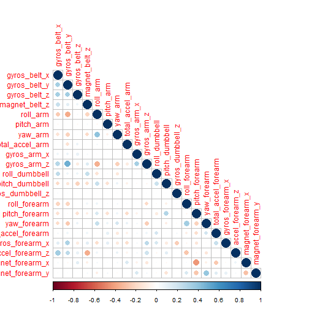
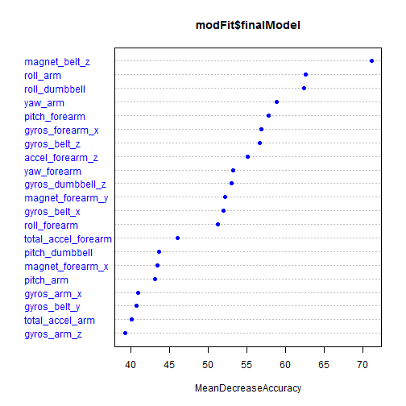

### Background

The data for this project come from accelerometers on the belt, forearm, arm, and dumbbell of 6 participants, who were asked to perform barbell lifts correctly and incorrectly in 5 different ways. More information is available from the website [here](http://groupware.les.inf.puc-rio.br/har). We will build a machine learning algorithm to predict the manner in which they did the exercise based on a training data set. The model will be evaluated by predicting 20 different test cases. 

### Data Loading


```r
# Load libraries
library(caret)
```

```
## Loading required package: lattice
## Loading required package: ggplot2
## Find out what's changed in ggplot2 with
## news(Version == "1.0.0", package = "ggplot2")
```

```r
library(corrplot)
# Download data
#if(!file.exists("data")) {
        #dir.create("data")
#}
#download.file("https://d396qusza40orc.cloudfront.net/predmachlearn/pml-training.csv", "./data/train.csv")
#download.file("https://d396qusza40orc.cloudfront.net/predmachlearn/pml-testing.csv", "./data/test.csv")
#list.files("./data")
#date()
# Load Data
train <- read.csv("./data/train.csv", header = TRUE, na.strings = c("NA", ""))
test <- read.csv("./data/test.csv", header = TRUE, na.strings = c("NA", ""))
dim(train)
```

```
## [1] 19622   160
```

### Data Cleaning


```r
# Handle missing values
missing <- colSums(is.na(train))
unique(missing)
```

```
## [1]     0 19216
```

```r
sum(missing == 19216)
```

```
## [1] 100
```

```r
train <- train[, missing == 0]
test <- test[, missing == 0]
dim(train)
```

```
## [1] 19622    60
```

```r
# Remove unrelevant variables
names(train)
```

```
##  [1] "X"                    "user_name"            "raw_timestamp_part_1"
##  [4] "raw_timestamp_part_2" "cvtd_timestamp"       "new_window"          
##  [7] "num_window"           "roll_belt"            "pitch_belt"          
## [10] "yaw_belt"             "total_accel_belt"     "gyros_belt_x"        
## [13] "gyros_belt_y"         "gyros_belt_z"         "accel_belt_x"        
## [16] "accel_belt_y"         "accel_belt_z"         "magnet_belt_x"       
## [19] "magnet_belt_y"        "magnet_belt_z"        "roll_arm"            
## [22] "pitch_arm"            "yaw_arm"              "total_accel_arm"     
## [25] "gyros_arm_x"          "gyros_arm_y"          "gyros_arm_z"         
## [28] "accel_arm_x"          "accel_arm_y"          "accel_arm_z"         
## [31] "magnet_arm_x"         "magnet_arm_y"         "magnet_arm_z"        
## [34] "roll_dumbbell"        "pitch_dumbbell"       "yaw_dumbbell"        
## [37] "total_accel_dumbbell" "gyros_dumbbell_x"     "gyros_dumbbell_y"    
## [40] "gyros_dumbbell_z"     "accel_dumbbell_x"     "accel_dumbbell_y"    
## [43] "accel_dumbbell_z"     "magnet_dumbbell_x"    "magnet_dumbbell_y"   
## [46] "magnet_dumbbell_z"    "roll_forearm"         "pitch_forearm"       
## [49] "yaw_forearm"          "total_accel_forearm"  "gyros_forearm_x"     
## [52] "gyros_forearm_y"      "gyros_forearm_z"      "accel_forearm_x"     
## [55] "accel_forearm_y"      "accel_forearm_z"      "magnet_forearm_x"    
## [58] "magnet_forearm_y"     "magnet_forearm_z"     "classe"
```

```r
train <- train[, -c(1:7)]
test <- test[, -c(1:7)]
# Make sure the predictors are numeric
str(train$classe)
```

```
##  Factor w/ 5 levels "A","B","C","D",..: 1 1 1 1 1 1 1 1 1 1 ...
```

```r
sum(sapply(train, is.numeric))
```

```
## [1] 52
```

### Variable Selection


```r
# Remove highly correlated variables (r > 0.5)
corVar <- findCorrelation(cor(train[, -length(train)]), cutoff = 0.5)
train <- train[, -corVar]
test <- test[, -corVar]
corrplot(cor(train[, -length(train)]), method = "circle", type = "lower")
```

 

We have **21** predictors left in the training dataset, which is a good number for model fitting. 

### Data Partition and Model Fitting


```r
# Partition the training dataset in 70% training and 30% cross validation
inTrain <- createDataPartition(train$classe, p = 0.7, list = FALSE)
trainSub <- train[inTrain,]
crossVal <- train[-inTrain,]
# Fit the training data using Random Forests algorithm for accuracy
modFit <- train(classe ~ ., method = "rf", data = trainSub, 
                trControl = trainControl(method = "cv"), importance = TRUE)
```

```
## Loading required package: randomForest
## randomForest 4.6-10
## Type rfNews() to see new features/changes/bug fixes.
```

```r
# Plot predictor importance
varImpPlot(modFit$finalModel, sort = TRUE, type = 1, pch = 19, col = "blue")
```

 

### Model Validation


```r
pred <- predict(modFit, crossVal)
confMat <- confusionMatrix(pred, crossVal$classe)
confMat$table
```

```
##           Reference
## Prediction    A    B    C    D    E
##          A 1667   17    0    1    0
##          B    6 1106   12    2    0
##          C    0    9 1006   26    0
##          D    0    5    6  934    0
##          E    1    2    2    1 1082
```

This model has an accuracy of **0.9847** and an out-of-sample error of **0.0153**.

### Test Data Prediction


```r
answers <- predict(modFit, test)
answers
```

```
##  [1] B A B A A E D B A A B C B A E E A B B B
## Levels: A B C D E
```

```r
# Create submission files
pml_write_files = function(x){
  n = length(x)
  for(i in 1:n){
    filename = paste0("problem_id_",i,".txt")
    write.table(x[i],file=filename,quote=FALSE,row.names=FALSE,col.names=FALSE)
  }
}
if(!file.exists("answers")) {
        dir.create("answers")
}
setwd("./answers")
pml_write_files(answers)
```

### Conclusion

We built a Random Forest machine learning model to predict weight lifting manners. This model has an accuracy of **0.9847** and an out-of-sample error of **0.0153**. After submitting results to coursera, we got all the predictions right.
